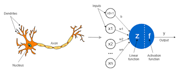

# Artificial Intelligence
## Perceptron

Perceptron is the basic unit of intelligence in machines. Intelligence begins with perception. Hence the name. Back in 1960s when Frank Rosenblatt came into the scene wondering what to write his Master's thesis on, Computers themselves were covered with unreasonable amount of wires. Frank goes onto **imitate** intelligence found in nature. He built a primitive model of a neuron, theoretically. \



The operating principle of a biological neuron can be summarized as follows. First, it takes inputs from its dendrites (i.e. from other neurons). In a second step, a weighted sum of these inputs is performed within the soma. The result is then passed on to the axon hillock. If this weighted sum is larger than the threshold limit, the neuron will fire. Otherwise, it stays at rest. The state of our neuron (on or off) then propagates through its axon and is passed on to the other connected neurons via its synapses. Albeit very simple, this high-level description of the operating principle of a biological neuron is sufficient to understand the mathematical model of an artificial neuron proposed by McCulloch & Pitts in 1943.

- It has a binary output y ∈ {0, 1}, where y=1 indicates that the neuron fires and y=0 that it is at rest.
- It has a number N of excitatory binary inputs xₖ ∈ {0, 1}.
- It has a single inhibitory input i. If it is on, the neuron cannot fire.
- It has a threshold value Θ. If the sum of its inputs is larger than this critical value, the neuron fires. Otherwise, it stays at rest.

### Activation function
- It takes an input
- Gives an output.\
It is actually as simple as that. A standard example would be a simple switch which switches between ON, OFF states depending on the input given.\
Some common examples used in Machine Learning are Sigmoid and ReLU.
\
As we can see, these graphs try to differentiate between positive and negative values. These are used by the perceptron to classify which category an instance of given data belongs to. It basically asks the activation function, the answer will be a typical "0" or "1". It will classify accordingly. Thus activation functions are distinguishing/classifying functions.\

### Example with implementation in Python3 
Using **sigmoid** activation function.
\\[\S = \frac{1}{1+e^\-x}\\]
```python
def activation_func(value):    #Tangent Hypotenuse
   #return (1/(1+np.exp(-value)))
   return ((np.exp(value)-np.exp(-value))/(np.exp(value)+np.exp(-value)))	


```
### Perceptron training algorithm
- Randomize the weights and biases
- Loop through the features of the dataset
   - Compute activation value
   - Initialize yn
   - Check if the neuron fires or not using **a = 0.7** as the threshold
   - Update the weights
- Return the trained weights
```python
def perceptron_train(in_data,labels,alpha):
    X=np.array(in_data)
    y=np.array(labels)
    weights=np.random.random(X.shape[1])
    original=weights
    bias=np.random.random_sample()
    for key in range(X.shape[0]):
        a=activation_func(np.matmul(np.transpose(weights),X[key]))     
        yn=0
        if a>=0.7:
            yn=1
        elif a<(-0.7):
            yn=-1
        weights=weights+alpha*(yn-y[key])*X[key]
        print('Iteration '+str(key)+': '+str(weights))
    print('Difference: '+str(weights-original))
    return weights	

```
### Testing
- Loop through the features of the dataset
   - compute activation value a, now passing the sum of **trained weights** as the argument 
   - Check if the neuron fires using a = 0.7 as the threshold value
- return y
```python
def perceptron_test(in_data,label_shape,weights):
    X=np.array(in_data)
    y=np.zeros(label_shape)
    for key in range(X.shape[1]):
        a=activation_func((weights*X[key]).sum())
        y[key]=0
        if a>=0.7:
            y[key]=1
        elif a<(-0.7):
            y[key]=-1
    return y
```
